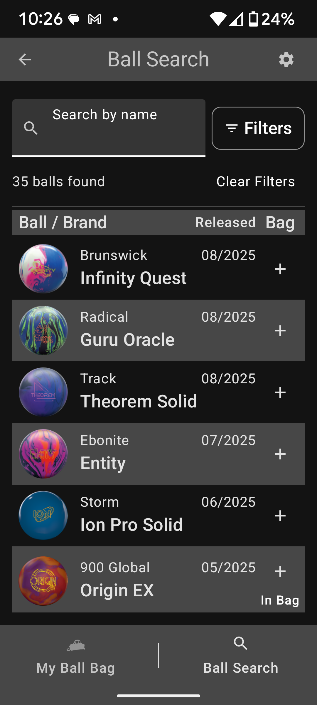

# ballbag - Bowling Ball Arsenal Management App

## Overview
BallBag is an Android application for bowling enthusiasts to track and manage their bowling ball collection. The app helps bowlers maintain their equipment by tracking usage statistics and maintenance schedules. 
Ball images and specifications are sourced from the public [bowwwl.com Bowling Ball Database](https://www.bowwwl.com/bowling-ball-database).  Images are not included with the download as they are not mine.

## Features
- **Ball Arsenal Management**: Add, edit, and remove bowling balls from your personal collection
- **Maintenance Tracking**: Monitor games played since last resurfacing and oil extraction
- **Customizable Maintenance Alerts**: Set personalized thresholds for maintenance warnings
- **Ball Usage Statistics**: Track when and how often each ball is used
- **Comprehensive Ball Database**: Browse extensive catalog of bowling balls with detailed specifications
- **Ball Details**: View complete specifications including coverstock, core type, factory finish, and more

## Technical Details
- Modern Android architecture with Jetpack Compose UI
- MVVM design pattern
- Kotlin coroutines for asynchronous operations
- Room database for local data persistence
- Material 3 design implementation

## Installation 
Clone the repository and open it in Android Studio. Build and run the app on your Android device or emulator.

## Requirements
- Android 5.0 (Lollipop) or higher
- Android Studio Arctic Fox or newer

## Planned Features
- Sync ball data across devices
- Ball performance tracking by lane condition
- Maintenance history logs

## Screenshots

### Ball Search and Management
<table>
  <tr>
    <td width="33%">
      
      
<strong>Ball Search:</strong> Search through the comprehensive database of bowling balls with filtering options.

    </td>
    <td width="33%">
      
      
<strong>Ball Details:</strong> View detailed specifications and add balls to your personal collection.

    </td>
    <td width="33%">
      
      
<strong>Ball Bag:</strong> View your personal collection with maintenance status and usage statistics.

    </td>
  </tr>
</table>

### Game Tracking and Maintenance
<table>
  <tr>
    <td width="33%">
      
      
<strong>Add Game History:</strong> Record games played with specific balls to track usage and maintenance needs.

    </td>
    <td width="33%">
      
      
<strong>Updated Ball Bag:</strong> See updated usage statistics after adding games to your history.

    </td>
    <td width="33%">
      
      
<strong>Maintenance Warnings:</strong> Receive alerts when balls need maintenance based on your custom thresholds.

    </td>
  </tr>
</table>
